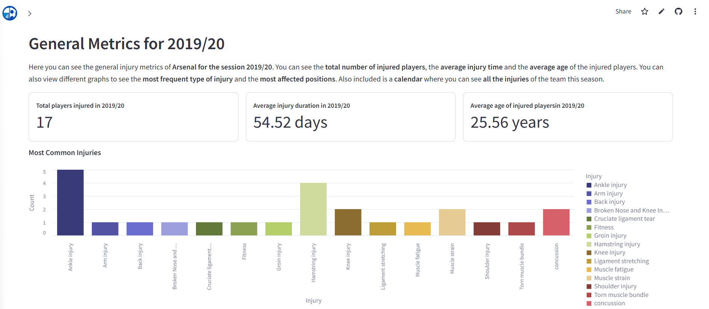
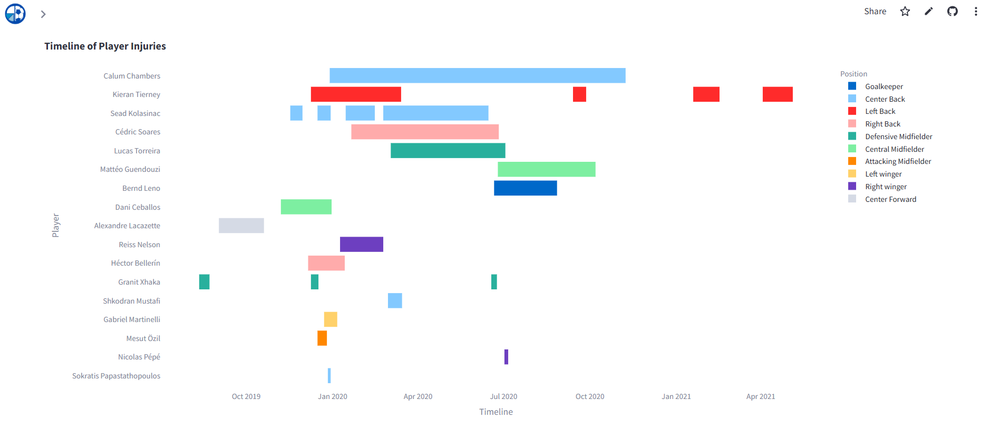
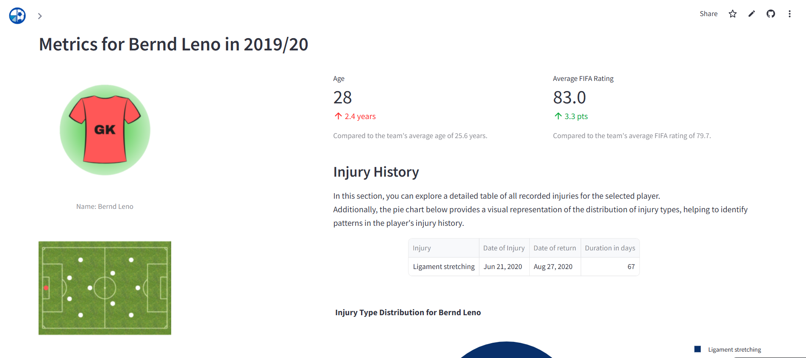

# ImpactOnThePitch

This application provides an in-depth analysis of player injuries and their impact on the team's performance. Built with Streamlit, the app offers interactive visualizations and detailed insights for football enthusiasts and analysts.

---

## Table of Contents
- [Introduction](#introduction)
- [Preview of the Application](#preview-of-the-application)
- [Try the App](#try-the-app)
- [How to Use](#how-to-use)
- [Project Structure](#project-structure)
- [Contributing](#contributing)
---

## Introduction
Discover how player injuries shape the game in the Premier League.

This platform explores a detailed dataset covering the impact of player absences on team performance across eight clubs—**Arsenal, Aston Villa, Brentford, Burnley, Everton, Manchester United, Newcastle and Tottenham**—between 2019 and 2024. With over **600 injury records**, we reveal how missing players affect match results, team dynamics, and individual performances.

### Data Highlights:
- **Insights on Key Clubs**: Analyze how teams adapt when key players are sidelined.
- **Performance Metrics**: Compare pre- and post-injury match ratings and statistics.
- **Extensive Sources**:
  - **Transfer Market**: Injury records and durations.
  - **Football Critic**: Player ratings for impacted matches.
  - **Sky Sports**: Supplemental match statistics and performance data.
  - **Link to dataset**: [Player Injuries and Team Performance Dataset](https://www.kaggle.com/datasets/amritbiswas007/player-injuries-and-team-performance-dataset/data)

Use our interactive tools to uncover patterns, trends, and the hidden impact of injuries on the beautiful game.

---

## Preview of the Application
### Features
- Visualization of injury history per player.
- Dynamic charts of performance before, during, and after injuries.
- Seasonal and positional analysis.
- Gantt chart to identify periods with multiple injuries.
- Interactive interface to explore statistics.

### Here’s a quick look at the app:
Here is a small sample of what you can see in the APP.  In the first two images you can see statistics of Arsenal as a team in the 2019/20 season. In the third one you can see statistics of a specific player of arsenal, Bernd Leno, who had an injury that season.

If you want to see more, don't forget to check it out at [ImpactOnThePitch](https://impactonthepitch.streamlit.app/)!!!







---

## Try the App

Click [here](https://impactonthepitch.streamlit.app/) to access the live app.

---

## How to Use

If you want to run the app locally, follow the steps below.

### Requirements
- Python >= 3.8
- Required libraries (detailed in `requirements.txt`).

### Installation
1. Clone this repository:
   ```bash
   git clone https://github.com/Rosa-Hornero/ImpactOnThePitch.git
   ```
   
2. Navigate to the project directory:
   ```bash
   cd your-repo
   ```
   
3. Install dependencies:
   ```bash
   pip install -r requirements.txt
   ```

4. Run the application:
   ```bash
   streamlit run main.py
   ```

5. Open the browser at the specified URL, typically: `http://localhost:8501`.

---

## Project Structure
- **`static/`**
  - **`images/`**: Images, icons, and visual resources.
  - `player_injuries_impact.csv`: CSV files containing teams statistics and data.
- **`utils/`**: key functions.
- **`views/`**: app navigation pages.
- **`main.py`**: app main page.
- `requirements.txt`: Project dependencies.
- `README.md`: Project documentation.

---

## Contributing

We welcome contributions! Please feel free to submit pull requests or report issues.

## Contact
If you have any questions or suggestions about this project, feel free to reach out:
ach out:

- Email: [rosa.hornero1@gmail.com]
- LinkedIn: [Rosa Hornero](https://www.linkedin.com/in/rosa-hornero/)
- Twitter: [@hornero_rosa](https://x.com/hornero_rosa)

